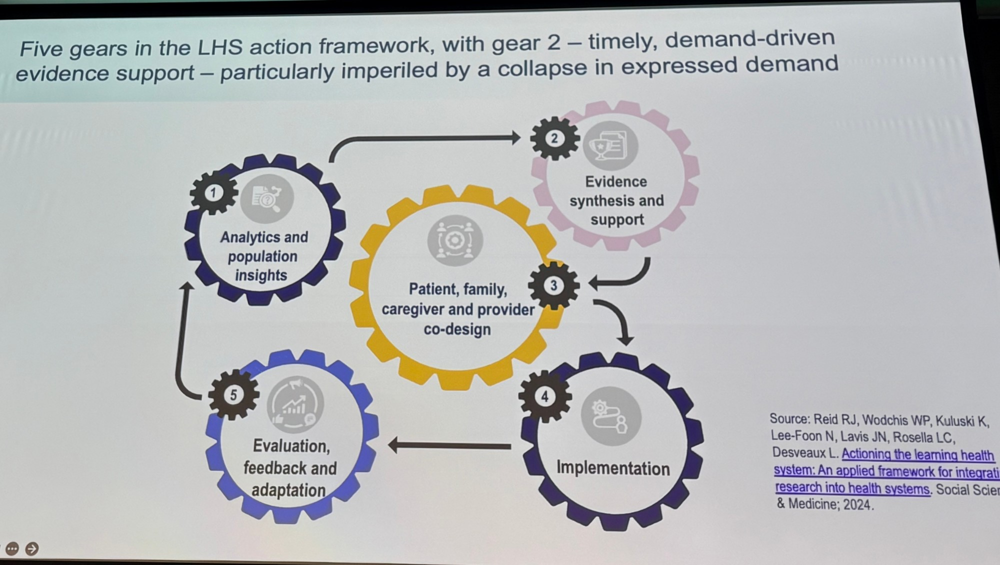
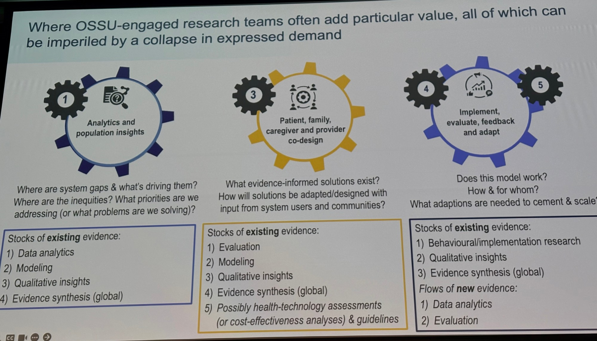

I attended OSSU Research Day in Toronto in September 2026. Below is my summary of the insights from the Learning Health System panel discussion.

## Data-Driven Decision-Making Challenges: Timeliness and Completeness

The five gears are meant to work synergistically, as a continuous learning cycle. But when data arrives late, the loop breaks down. We cannot evaluate the impact of previous policies in time, so the lessons never reach the next round of decisions.

The example comes from Heather Bullock: the Ontario Health Team (OHT) dashboard for primary care attachment.

## 1. Timeliness

Timeliness of data and evidence remains a constant concern.

- The dashboard runs about five months behind. By the time the data (e.g., CIHI) arrives, the window to course-correct has already closed — "we can't tell if they're making a difference, because we're getting the data way after we've tried those efforts."
- Delayed data and evidence mean we cannot use them to tell the story of what is happening right now. In that gap, people speculate, and speculation can lead to misinformation.

## 2. Completeness

- The team initially had only postal code data, and used it to target outreach toward adults and older adults.
- Once age/sex data finally came through, it showed that the newly attached population was mostly males aged 18–35. The outreach had been misaligned the whole time, and there was no way to know without that variable.

Some background:
## The Learning Health System (LHS) action framework

The five gears are meant to work synergistically, as a continuous learning cycle. But when data arrives late, the loop breaks down. We cannot evaluate the impact of previous policies in time, so the lessons never reach the next round of decisions.

Reference: Actioning the Learning Health System: An applied framework for integrating research into health systems 10.1016/j.ssmhs.2024.100010