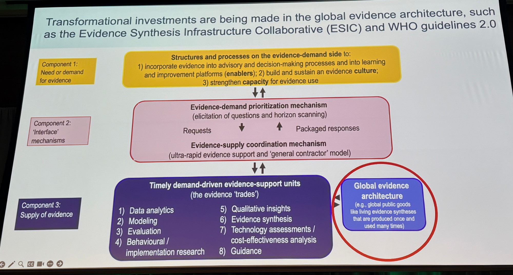

## What are the blind spots in learning health systems as we accelerate our use of AI?

Summary of views from the panel discussion.

Clinical and public policymakers are already using AI every day, because the answers they're getting back feel "pretty plausible." But Dr. John Lavis pointed out that a good clinical or policy decision needs to consider four dimensions of data:

1. **Patient data across the care continuum** (not only in the hospital)
2. **Data on local epidemiology**
3. **Data on local resource availability** (e.g., tests, treatments)
4. **Data about living evidence syntheses and living guidelines.** Ideally, these help us understand what moves the needle on quadruple-aim metrics, for whom, and in what context.

AI tools like OpenEvidence aren't there yet.

## Background terms

### Quadruple-aim metrics

1. Improving population health
2. Improving patient experience of care
3. Reducing per capita cost of care
4. Improving the work life / experience of healthcare providers

### Global evidence architecture investments

The Evidence Synthesis Infrastructure Collaborative (ESIC) will be the "go to" place for four types of outputs:

1. **Interoperable data that are synthesis- and AI-"ready"** (drawing from "continuous evidence surveillance" mechanisms) and that are synthesis-derived (e.g., findings from and risk-of-bias assessments of empirical studies). This covers not only patient data, but data extracted from all scientific studies.
2. **Living evidence maps**
3. **Policy-scale living evidence syntheses**
4. **Decision-relevant evidence products**

## My takeaway

These four dimensions are a useful checklist for evaluating and using AI in health system decision-making. Efforts like ESIC are working to close that gap, but current AI tools aren't there yet.
