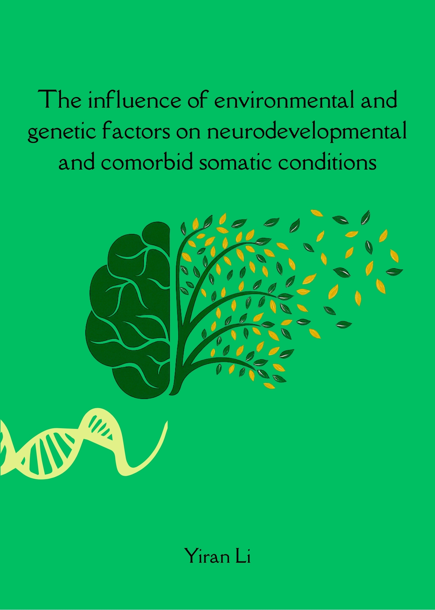

🎓 I am proud to share that I have successfully defended my PhD thesis at the **University of Groningen**.

**Thesis title:**
*"The influence of environmental and genetic factors on neurodevelopmental and comorbid somatic conditions"*

My dissertation investigates how environmental, familial, and genetic factors contribute to neurodevelopmental conditions and their somatic comorbidities, using large-scale cohort, registry, and molecular data.

I am deeply grateful to my supervisors **Catharina Hartman, Harold Snieder, Tian Xie, Melissa Vos**, collaborators, colleagues, and family for their invaluable support throughout this journey.

## Links

- 📖 **Full thesis (PDF):** [/uploads/phd-thesis.pdf](/uploads/phd-thesis.pdf)
- 🔗 **University of Groningen record:** [research.rug.nl](https://research.rug.nl/en/publications/the-influence-of-environmental-and-genetic-factors-on-neurodevelo/)

